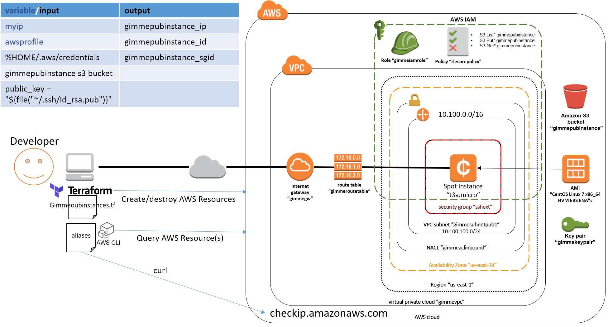

* [Overview](#overview-of-gimmepubinstance)
* [Setup](#setup)
  * [Prereqs](#prereqs)
  * [Quick Start](#quick-start)
  * [Commands](#commands)
* [How it Works](#how-it-works)

# Overview of `gimmepubinstance`
This repo contains [Terraform](https://www.terraform.io/) code that can be used to quickly spin up a CentOS instance in the AWS U.S. East Coast region for testing cloud related functions. It creates a dedicated VPC and dependencies (routes, subnets, NACL, security group, IAM role, SSH keypair, ...). The produced instance is nicknamed (and tagged) `gimmepubinstance`. Feel free to use it as a base cloud environment for a bigger purpose.




# Setup

## Prereqs
Have the following steps completed prior to running terraform:
1. AWS account created
1. Install [aws cli](https://aws.amazon.com/cli/) on your laptop/workstation
1. AWS CLI configured with your AWS root account user credentials saved under `$HOME/.aws/credentials`
1. local ssh key pair (priv/pub) at the following location: `~/.ssh.id_rsa.pub` (something like ssh-keygen can be used to create them)
1. [Terraform CLI](https://www.terraform.io/downloads.html) installed on your laptop/workstation
1. Install `git` cli on your laptop/workstation
1. Clone this repo to your laptop/workstation using git. Make sure to take note of its path on your file system. You'll need it in a later step.


## Quick Start
If you want to fully understand what the code in this repo does, skip to the next sections for step by step procedures. If you want to quickly get up and running from a \*nix laptop/workstations, a sample `aliases` file has been included in this repo that turns the detailed commands into a single word bash alias. Perform these steps to setup the one word aliases  `gimmepubinstance` & `deletegimmeinstance`.
1. Add the below to the bottom of your `~/.bashrc` file making sure to update `/path/to/gimmepubinstance` path to your actual path to this locally cloned gimmepubinstance repo on your laptop/workstation.
   ```
   source /path/to/gimmepubinstance/aliases
   ```
2. Update the `gimmeprofile` & `gimmepath` bash variable values within the [aliases](./aliases) file to reflect your AWS CLI profile and path to this cloned repo.
   ```
   export gimmeprofile=foo                   #<---UPDATE ME
   export gimmepath="$HOME/gimmepubinstance" #<---UPDATE ME
   ```
3. Now you are ready to create the AWS instance!
   ```
   gimmepubinstance
   ```
4. Clean up the AWS instance and VPC resources created in step `3.` when they are no longer needed.
   ```
   deletegimmeinstance
   ```

## Commands
Instead of using the above Quick Start [aliases](./aliases) method to simplify creation of the AWS instance, these commands can manually be run to create the instance. Steps 1 & 2 should work without being modified unless you prefer a different AWS region or have non standard AWS CLI settings.
1. With an editor, update the local [gimmepubinstance.tf](./gimmepubinstance.tf) file `provider`, `backend` stanzas with
   1. the path to your AWS credential
   2. desired AWS Region
   3. globally unique S3 bucket name since I already grabbed gimmepubinstance ;)
   ```
   provider "aws" {
     shared_credentials_file = "%HOME/.aws/credentials"
     region = "us-east-1"
   }
   terraform {
     backend "s3" {
       bucket = "gimmepubinstance"
       key = "terraform.tfstate"
       region = "us-east-1"
     }
   }
   ```
1. With an editor, also edit the [./firstrun/main.tf](./firstrun/main.tf) file to match any changes made in the above step `1.`
   ```
   provider "aws" {
     shared_credentials_file = "%HOME/.aws/credentials"
     region = "us-east-1"
   }
   ```
1. Run the terraform.
   * NOTE: Because the AWS CLI supports multiple AWS accounts set as different profiles in your `~/.aws/credentials` file, you'll need to preface all terraform commands with the `AWS_PROFILE=foo` string as well as a `-var AWS_PROFILE=foo` because of a terraform AWS tagging workaround.
   ```
   unset AWS_DELEGATION_TOKEN AWS_ACCESS_KEY AWS_SECRET_KEY
   git clone https://github.com/thesystemninjaneer/gimmepubinstance
   cd gimmepubinstance/firstrun
   AWS_PROFILE=foo terraform init .
   AWS_PROFILE=foo terraform apply -auto-approve .
   cd ..
   AWS_PROFILE=foo terraform init .
   AWS_PROFILE=foo terraform apply -auto-approve -var myip=$(curl checkip.amazonaws.com)/32 -var awsprofile=foo .
   pubip=$(AWS_PROFILE=foo terraform output gimmepubinstance_ip|grep [0-9]|cut -f2 -d\")
   ssh centos@$pubip -i $HOME/.ssh/id_rsa
   ```

# How it Works

This repo uses a tool called Terraform to provision resources in the AWS Cloud. Terraform allows developers to define Infrastructure as Code (IaC) using a HashiCorp created domain specific language abstracted away from any particular cloud providers specific API. This is handy because the same developer IaC definitions can be reused against any Terraform supported IaC providers (e.g. AWS, Azure, OpenStack, ...) and Terraform will worry about translating IaC resource requests to the IaC providers API's.

One of the advantages of using Terraform over other IaC tools is that it supports tracking state of all resources it creates using a single state file. It also supports storing its state in a network location for ease of access/redundancy. When using an AWS S3 bucket to hold the state file, as this repo does, a weird scenario occurs requiring the S3 bucket to exist prior to terraform being able to create any AWS resources which cannot also be managed by Terraform per design decision made by HashiCorp.

To accomplish automated creation of the state bucket, a sub folder holds a terraform file, [./firstrun/main.tf](./firstrun/main.tf), dedicated to its creation. We don't care about the state of this resource and keep its state local to the folder.
1. `gimmepubinstance` terraform S3 state bucket. All other resources created by this repo will be saved in a terraform.tfstate file kept in this bucket.

The [gimmepubinstance.tf](./gimmepubinstance.tf) file uses the AWS Terraform Provider to create the following:
1. `gimmevpc` VPC with a CIDR block `10.100.0.0/16`
1. `gimmesubnetpub1` public subnet of `10.100.100.0/24` in the above VPC
1. `gimmegw` internet gateway in the above VPC
1. `gimmeroutetable` route table with a default route `0.0.0.0/0` attached to the internet gateway created above
1. `gimmeacl` NACL applied to the above subnet with the following rules
   * ingress
     1. `22/tcp` from ip saved in variable `myip`
     1. `1024-65535/tcp` from `0.0.0.0/0`
   * egress
     1. `1024-65535/tcp` to `0.0.0.0/0`
     1. `80/tcp` to `0.0.0.0/0`
1. `ssh-from-gimme-$myip` security group
   * ingress
     1. `22/tcp` from ip saved in variable `myip`
   * egresss
     1. all port/protocols to `0.0.0.0/0`
1. `gimmekeypair` SSH keypair based on ~/.ssh/id_rsa.pub local public key
1. `gimmeiamrole` IAM role dedicated for to launch the `gimmepubinstance` ec2 instance with
1. `gimmepubinstancepolicy` IAM policy to attach to the above `gimmeiamrole` for granting `List*,Get*,Put*` permissions to the `gimmepubinstance` ec2 instance for a bucket called `gimmepubinstance` created by the sub folder `runfirst` terraform
1. `gimmeiamprofile` IAM profile needed before the above IAM policy `gimmepubinstancepolicy` can be attached to the IAM role `gimmeiamrole`
1. `gimmeiamattach` attaches the above `gimmepubinstancepolicy` IAM policy to the `gimmeiamrole` IAM role
1. `gimmepubinstance` finally creates the `t3a.micro` ec2 instance using the latest CentOS AMI in the AWS marketplace and the above created IAM policies/roles/profiles/subnet with a public ip saved in the `gimmepubinstance_ip` Terraform output variable to reference for ease of later SSH connections
